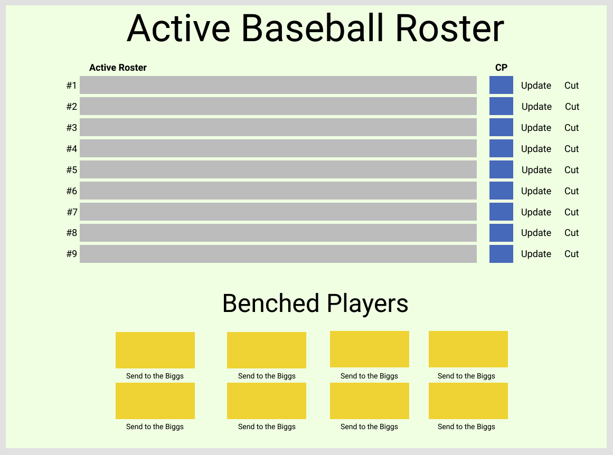
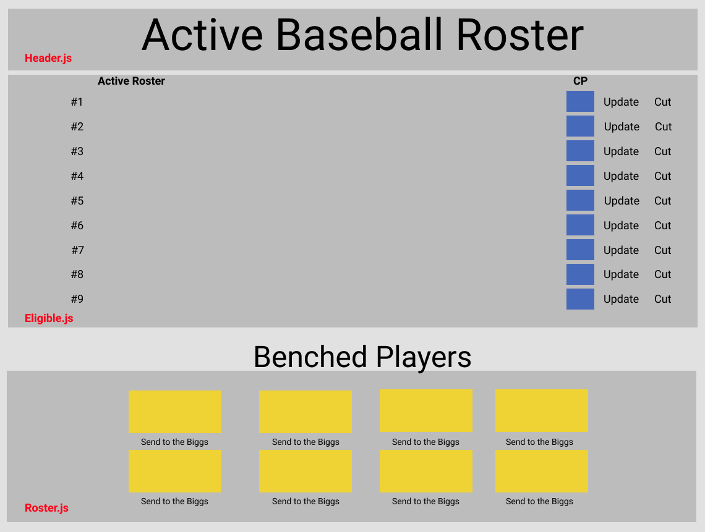
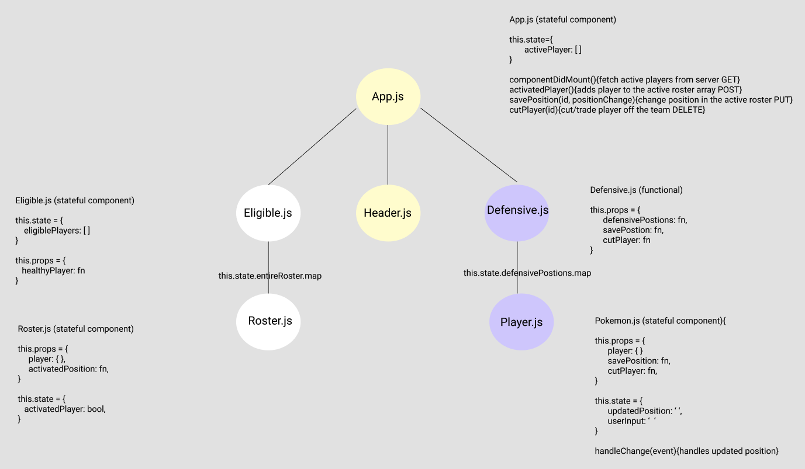

# Baseball Roster

## Application Concept and Wireframe
### Application Concept
- This is a baseball roster app
- We will be utilizing the MLB Data API (if time permits) for the baseball stat data
- Full CRUD
    - GET: get all baseball players
    - POST: Baseball players in lineup will be posted to our array
    - PUT: Give the baseball player a feilding position 
    - DELETE: Cut baseball player from the team & or trade to a different team. 

### Functionality
- We want a header at the top of the page to display the name of our app "Baseball Roster"
- When the app loads, nine slots will be filled with team players and who is actice on the roster. 
    - When the players are clicked it shows the bio/stats of the player.
- Once we select a baseball player to be an acitve player, we will push that player to the active roster
- The active roster will show those selected by the "coach" that is active to play in the game
- The Roster will show the name of the baseball player
- The Roster will have a button to cut the player from being "Active". 
- The Roster will update with the next eligable player. 

* > Controller File - 5.0 pts. 
* > REST - 5.0 pts.
* > Promises - 5.0 pts. 
* > Destructuring - 6.0 pts. 

### Endpoints
- GET - fetch 9 active players to be on the roster (retrieve it on front/back)
- GET - fetch our roster
- POST - push new and active players to the roster
- PUT - change players defensive position
- DELETE - delete our player from the active roster. 

* > Express Endpoint - 8.0 pts. 
* > One endpoint that uses req.body - 5.0 pts. 
* > Parameters/Queries - 6.0 pts. 
* > Full CRUD - 5.0 pts. 

### Component Architecture
- App.js (stateful: hold our active player information, this.state.activePlayer)
    - Header.js (functional)
    - Eligible.js (stateful: axios request to fetch 9 healthy eligible baseball players)
        - Roster.js (stateful: this.state.fieldingPostion)
    - Defensive.js (functional)
        - Player.js (stateful: this.state.name, this.state.changePosition)

* > Stateful compoenent - 15 pts.
* > Stateless, display component - 10 pts. 

Planning to accomplish with this project:
* > Default Styling - 2.0 pts.
* > Title - 2.0 pts. 
* > Flex Box - 10 pts. 
* > Semantic Tags - 6.0 pts. 

### Wireframe

